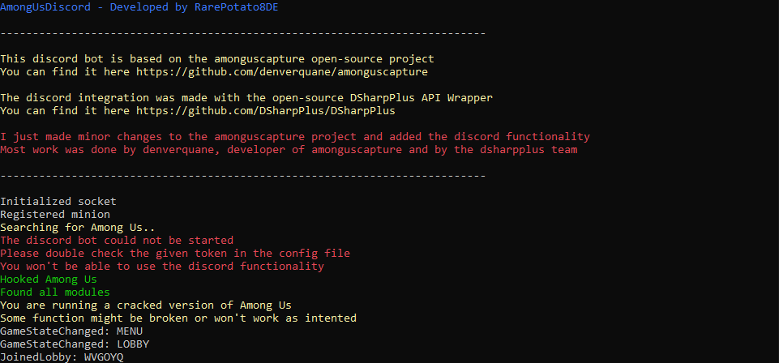

# AmongUsDiscord

With AmongUsDiscord you can monitor everything that happens in among us.
You have some functions like automatically mute everyone in a specific discord
channel when you are doing tasks, and unmute them in a discussion.

## Usage

Before downloading:
This program is written in .NET Core, so you will need the .NET Core Runtime.
You can download it for free for x64 and x86 here:
https://dotnet.microsoft.com/download/dotnet-core/current/runtime

Download and compile the source code or the newest release version.
At the first run the program will create a configuration file (config.json)
which you can customize to your needs.

If you just want to monitor the game, and don't use the discord integration
you also don't have to enter a bot token.

After saving your changes, restart the program and it'll work just fine!

## Meta

Distributed under the MIT license. See ``LICENSE`` for more information.
